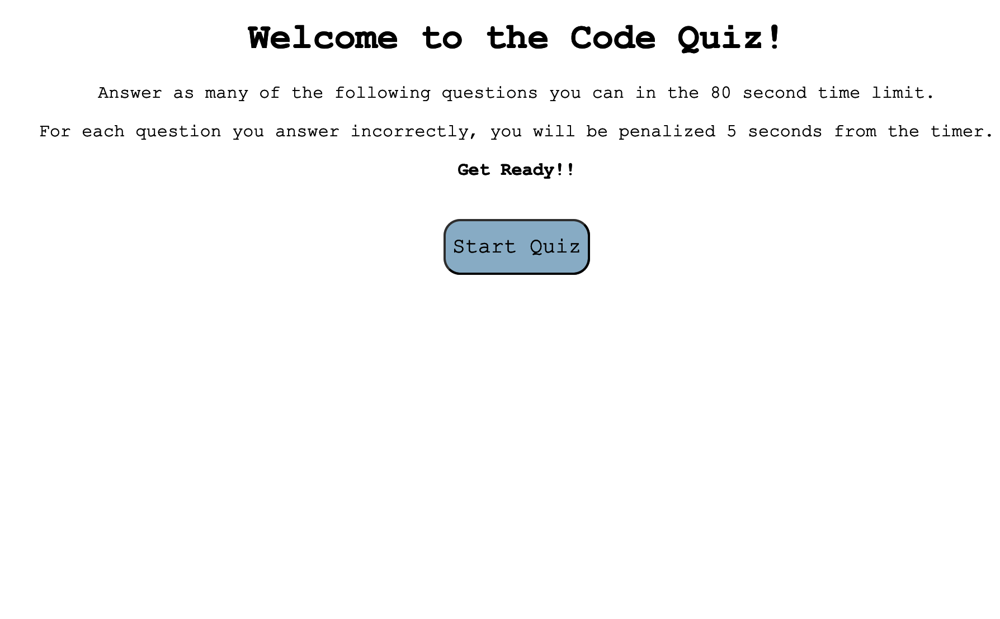
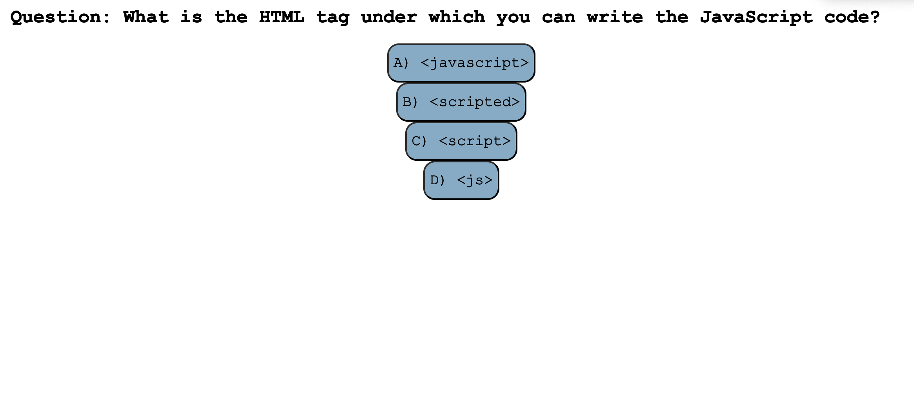
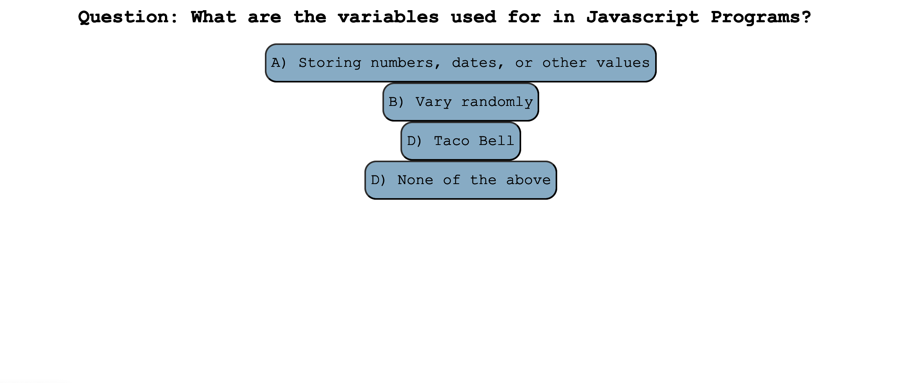
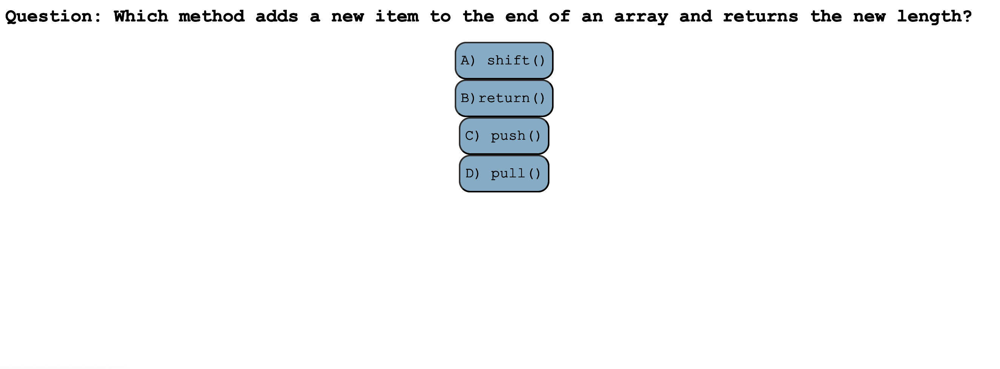
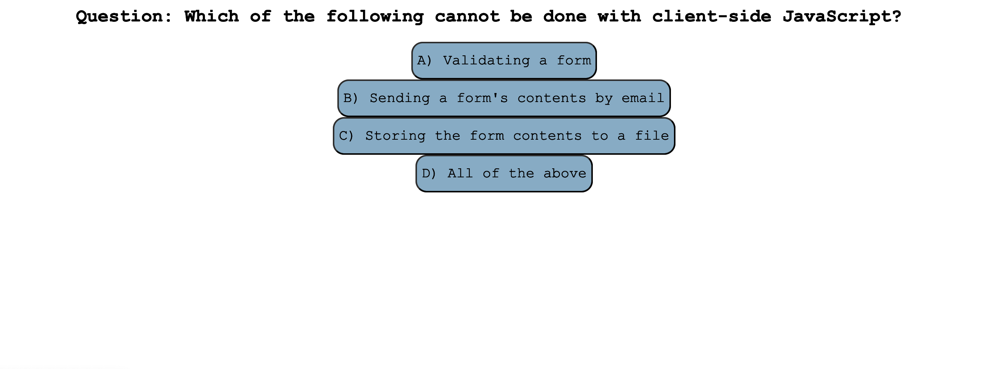

# Web-APIS-Code-Quiz

## Description

In this project I created a mini quiz for users to test their knowledge on JavaScript. I included a time limit and what their score is after each question answered. The user will also be able to see the highest scores that were received.

[Link to deployed application](/)

## Installation

N/A

## Usage

In order to run my project you must select "Start Quiz" and go through the questions answering each one. If you get the answer wrong it will take off 5 seconds on the timer. At the end of the quiz you will see your score along with the highest scores on the quiz if taken by other users.

## Credits

N/A

## License

[MIT](https://choosealicense.com/licenses/mit/)# Password-Generator
